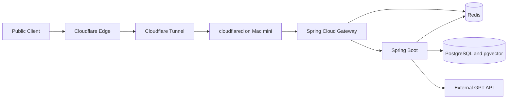
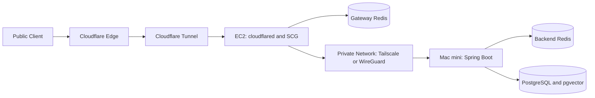
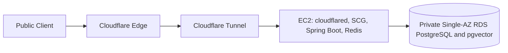

# Carelog Runtime·Deployment Profiles

이 문서는 [ADR-001](decisions/ADR-001-carelog-runtime-deployment-profiles.md)의 설명용 Architecture다. 실제 Domain, Hostname, IP, Tunnel ID, Secret은 기록하지 않는다.

## Profile 비교

| 항목 | Profile 1: Mac mini Baseline | Profile 2: Hybrid Edge | Profile 3: AWS Migration |
| --- | --- | --- | --- |
| 상태 | 현재 승인 | Deferred | Document Only |
| 목적 | 개발·Local Live E2E·파일럿·낮은 SLA | 안정적 Edge와 다수 Backend | 데이터·SLA·확장 요구 대응 |
| Runtime 위치 | Mac mini 한 대 | EC2 Edge + Mac mini Backend | 단일 EC2 + Private RDS |
| Redis 수 | 1 | 2 후보; revocation 재설계 전 도입 금지 | 1, 이후 Managed Redis 후보 |
| PostgreSQL 위치 | Mac mini | Mac mini | Private Single-AZ RDS |
| 공개 Component | Cloudflare Edge; Tunnel로 연결된 SCG만 | Cloudflare Edge; EC2의 SCG만 | Cloudflare Edge; EC2의 SCG만 |
| Private Network | 동일 Host loopback/private bridge | VPN overlay | AWS private data path |
| 월 고정 인프라 비용 | 낮음 | 중간 | 중간 이상 |
| 운영 난이도 | 낮음, Host 책임 집중 | 높음, Edge·VPN·Redis 분리 | 중간, AWS·RDS 관리 추가 |
| 주요 장애점 | Mac, 전원, ISP | EC2, Tunnel, VPN, Mac | EC2, Tunnel, RDS 단일 AZ |
| 도입 Trigger | 현재 기준선 | 공격 격리·다수 Backend·Edge 분리 | SLA·데이터 중요도·자원 한계 |

## Profile 1 — Mac mini Baseline

## Profile 2 — Hybrid Edge Improvement (Deferred)

## Profile 3 — AWS Migration Target (Document Only)

## Trust Zone

| Zone | 경계와 허용 흐름 |
| --- | --- |
| Public Client | Browser는 Cloudflare 공개 hostname만 사용 |
| Cloudflare Edge | TLS·DDoS 경계. Origin 보안을 대체하지 않음 |
| Tunnel Origin | cloudflared가 outbound 연결로 SCG만 전달 |
| Gateway Boundary | JWT 검증, Header 정규화, Rate Limit, Gateway Secret 주입 |
| Application Boundary | OAuth·업무 API·GPT 호출 정책 |
| Data Boundary | Redis·PostgreSQL은 private bind만 허용 |
| External GPT API | 최소화·비식별화된 허용 데이터만 Backend에서 전달 |

## Data Flow

| 흐름 | 경로 | 보안 조건 |
| --- | --- | --- |
| OAuth Authorization | Client → SCG → Backend → Provider redirect | state·PKCE verifier를 Redis 단기 상태로 저장, 로그 금지 |
| OAuth Exchange | Client → SCG → Backend → Provider | verifier 검증, state 단회 소비 |
| JWT 인증 | Client → SCG → Backend | Gateway가 외부 인증 Header를 제거 후 검증된 Header만 주입 |
| Token Blacklist | Backend logout → Redis; SCG auth → Redis | `blacklist:*` 공유 계약, Persistence 필요 |
| Rate Limit | SCG → Redis | `request_rate_limiter.*`; 장기 Backup 대상 아님 |
| 영속 데이터 | Backend → PostgreSQL | 외부 공개 금지, Backup/Restore 검증 필요 |
| AI 요청 | Backend → GPT API | Core CRUD와 격리, 민감정보는 별도 승인 전 전달 금지 |

## Public Repository와 Private 운영 문서의 경계

Public Repository에는 Profile, 일반화 Diagram, Trust Zone, 보안 원칙, Trigger, Gap, Merge Gate, Sanitized Checklist만 둔다. 실제 Domain, Hostname, Public/Private IP, Mac 사용자명, 홈 네트워크, Tunnel ID/Token, Kakao·Gateway·Redis·PostgreSQL Secret, Backup 위치·Credential, 민감 Firewall 값, 환자·고객 데이터는 두지 않는다.

Private 문서 후보는 Environment Matrix, 상세 Mac mini Deployment Runbook, Backup/Restore Runbook, AWS Migration Runbook, Secret Inventory, Incident Recovery Runbook이다.
