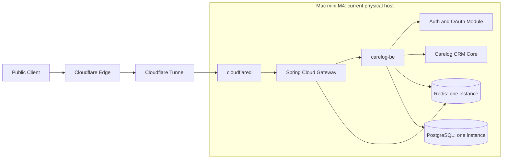
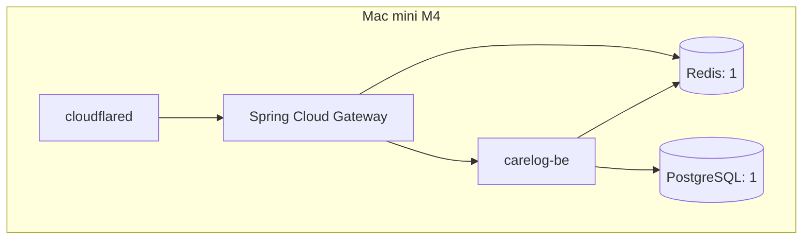
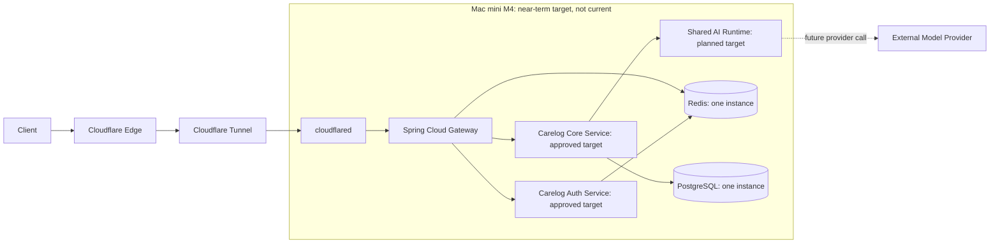
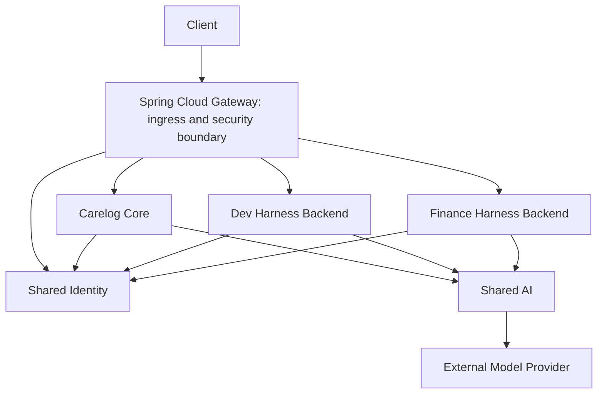
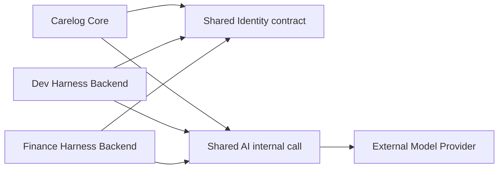

# Carelog Runtime·Deployment Profiles and Portfolio Boundaries

이 문서는 [ADR-001](decisions/ADR-001-carelog-runtime-deployment-profiles.md)의 설명용 Architecture다. 현재 Deployable State, Near-term Target, 장기 Logical Platform을 분리한다. 실제 Domain, Hostname, IP, Tunnel ID, Secret은 기록하지 않는다.

## Portfolio Source of Truth

| 구분 | 영역 | 소유 책임 | 현재 운영 모드 |
| --- | --- | --- | --- |
| Product | Carelog | 고객·관계·기록·후속 업무·Handoff | Active Product |
| Product | Dev Harness | Multi-AI 작업 제어·세션 연결·승인 실행 | Stabilization / Maintenance |
| Product | Finance Harness | 금융 질문·Checklist·Journal·복기 | Foundation / Planned Build |
| Shared Platform | Shared Identity | 공통 사용자 식별·OAuth·Token 경계 | Supporting Platform |
| Shared Platform | Shared AI | 공통 Model 호출·정책·안전·비용 경계 | Architecture / Planned |

공용 플랫폼은 실제 Product 요구로 검증된 범위부터 확장한다. 논리 책임 분리, 독립 Deployment Unit, Physical Host 분리는 같은 결정이 아니다.

## 3-Profile 비교

| 항목 | Profile 1: Mac mini Baseline | Profile 2: Hybrid Edge | Profile 3: AWS Migration |
| --- | --- | --- | --- |
| 상태 | Current Baseline | Deferred | Document Only |
| 목적 | 개발·Local Live E2E·파일럿·낮은 SLA | 안정적 Edge와 다수 Backend | 데이터·SLA·확장 요구 대응 |
| Runtime 위치 | Mac mini 한 대 | EC2 Edge + Mac mini Application | 단일 EC2 + Private RDS |
| Redis 수 | 1 | 2 후보; revocation 재설계 전 도입 금지 | 1, 이후 Managed Redis 후보 |
| PostgreSQL 위치 | Mac mini | Mac mini | Private Single-AZ RDS |
| 공개 Component | Cloudflare Edge; Tunnel로 연결된 SCG만 | Cloudflare Edge; EC2의 SCG만 | Cloudflare Edge; EC2의 SCG만 |
| 주요 장애점 | Mac, 전원, ISP | EC2, Tunnel, VPN, Mac | EC2, Tunnel, RDS 단일 AZ |
| 도입 Trigger | 현재 기준선 | 공격 격리·다수 Backend·Edge 분리 | SLA·데이터 중요도·자원 한계 |

## Spring Cloud Gateway — 공통 Ingress / Security Boundary

SCG는 다섯 Portfolio Service에 포함하지 않는다. 공개·보호 경로 판정, JWT 검증, 외부 위조 Header 제거, 신뢰 Header 재생성, Gateway Secret, Routing, Rate Limit, Token Blacklist 조회를 담당한다.

Carelog·Finance·Dev Harness 비즈니스 정책, OAuth Provider 핵심 로직, AI Prompt 조립, 고객·금융·프로젝트 데이터 소유는 SCG 책임이 아니다.

## Current Deployable State

현재 독립 Deployment Unit은 Spring Cloud Gateway와 `carelog-be`뿐이다. Auth/OAuth는 `carelog-be` 내부 Module이며 독립 Auth Service가 운영 중이라는 뜻이 아니다. AI Runtime, GPT API 연동, pgvector, Dev Harness Spring Boot Backend, Finance Harness Spring Boot Backend도 현재 구현·운영 상태가 아니다.

### Current Physical Host

Mac mini 한 대에서 실행된다는 사실은 같은 Service라는 뜻이 아니다. 반대로 Java Package가 나뉘어도 독립 Build·Deploy·Rollback이 불가능하면 독립 MSA가 아니다.

## Near-term Runtime — Auth Approved, Shared AI Planned

Carelog Auth Service 물리 추출은 Near-term 승인 대상이다. Shared AI Runtime은 Near-term 계획 대상이며 현재 Runtime은 아니다. 초기에는 둘 다 같은 Mac mini에서 별도 Process 또는 Container로 실행할 수 있다.

Dev Harness Backend와 Finance Harness Backend는 각각 Product 개발 단계에서 추가한다. Near-term Target은 다섯 Service가 현재 모두 실행된다는 뜻이 아니다.

## Portfolio Target — Long-term Logical Architecture

Shared AI는 기본 Public Route로 노출하지 않는다. Shared Identity의 Login/OAuth Endpoint만 Gateway를 통해 공개될 수 있다. 각 Product Service는 다른 Product Service 또는 Shared Identity의 내부 Table을 직접 사용하지 않는다.

### Logical Service Dependencies

## Five Product·Platform Service Boundaries

| Service | 소유 책임 | 금지 또는 보류 책임 |
| --- | --- | --- |
| Carelog Core | 고객·관계·상담·케어 기록·Timeline·Follow-up·Handoff·조직/업무 Context·AI 업무 권한·결과 반영 통제 | OAuth Provider, Token 발급, 다른 Product 인증 데이터, 공통 AI 정책 |
| Dev Harness Backend / Control Plane | Multi-AI 작업 제어·Project Context·Session Handoff·Routing·Approval Queue·Closed-loop Work Management | 현재 독립 Spring Boot Runtime으로 과장 금지 |
| Finance Harness Backend | 금융 질문·Checklist·Journal·Review·금융 Product Policy·데이터 | 현재 완성 Backend로 과장 금지 |
| Shared Identity | Account·Password Login·OAuth·State·PKCE·Token·ExternalIdentity·Logout·Revocation·중립 인증 계약 | Product Domain Table 직접 소유 금지 |
| Shared AI | Provider Adapter·Prompt/Workflow·Context 최소화·RAG/Vector·Timeout/Retry·비용·Usage/Audit·공통 Safety | Product별 업무 판단 독점 금지 |

Carelog 의료·케어 판단은 Carelog가, Finance 투자자문 금지 정책은 Finance Harness가, Dev Harness 실행 승인 정책은 Dev Harness가 소유한다. Shared AI는 공통 AI 실행·안전·비용 경계만 소유한다.

## Module / Service / Deployment Unit / Physical Host

| 개념 | 현재 | 목표 |
| --- | --- | --- |
| Module Boundary | `carelog-be` 내부 Auth/OAuth Module, Carelog CRM Domain | 각 Product 내부 Module은 유지 가능 |
| Logical Service Boundary | 현재 코드에서 분리 중인 Auth와 Carelog CRM | Carelog Core, Dev Harness Backend, Finance Harness Backend, Shared Identity, Shared AI |
| Deployment Unit | Spring Cloud Gateway, `carelog-be` | Near-term: SCG, Carelog Auth Service, Carelog Core Service, Shared AI Runtime |
| Physical Host | Mac mini M4 한 대 | 초기에는 동일 Mac mini에서 복수 Unit 실행 가능 |

SCG는 공통 Ingress이므로 다섯 Portfolio Service 수에 포함하지 않는다.

## Redis Logical Ownership

현재 Physical Redis는 하나다. 물리 분리보다 Key Prefix, ACL User, Command Permission, TTL, Persistence 책임으로 논리 소유권을 나눈다.

| Owner | Key / 접근 |
| --- | --- |
| Gateway | `request_rate_limiter.*` 읽기·쓰기, `blacklist:*` 조회 |
| 현재 Auth Module / 향후 Shared Identity | `oauth:state:*` 생성·소비와 내부 PKCE verifier, `blacklist:*` 작성·필요 시 삭제 |
| Carelog Core | Auth Redis Key 직접 접근 금지 |
| Dev Harness Backend | 실제 필요 시 전용 Prefix; Auth Key 접근 금지 |
| Finance Harness Backend | 실제 필요 시 전용 Prefix; Auth Key 접근 금지 |
| Shared AI | 향후 Queue·Job·Usage 전용 Prefix; Auth·Rate Limit Key 접근 금지 |

Rate Limit Key는 장기 Backup 대상이 아니고 OAuth State는 단기 상태다. Blacklist는 보안 상태이므로 Persistence가 필요하다. Hybrid Edge에서 Redis를 단순히 둘로 나누면 Backend/Auth write와 Gateway read의 `blacklist:*` revocation 계약이 깨질 수 있다.

## PostgreSQL Logical Ownership

현재 Physical PostgreSQL은 하나다. 아래는 현재 Table 분리가 완료되었다는 뜻이 아니라 목표 소유권이다.

| Owner | 논리 데이터 |
| --- | --- |
| Shared Identity | Account, Credential, ExternalIdentity, Refresh Session, 인증·계정 상태 |
| Carelog Core | 고객, 관계, Timeline, 상담·케어 기록, Follow-up, Handoff |
| Dev Harness Backend | Project Context, Session, Handoff, Approval, Workflow 상태 |
| Finance Harness Backend | 금융 질문, Checklist, Journal, Review, 금융 Product 상태 |
| Shared AI | Provider Configuration Reference, AI Job, Usage, Audit, Knowledge Metadata, 필요 시 Vector Data |

다른 소유자의 Table 직접 Write를 금지하고 Cross-boundary Join을 최소화한다. 추출 시 API/Event 계약으로 전환하며 Schema·Database 분리와 pgvector 소유권은 실제 Use Case에 따른 후속 결정이다. pgvector는 현재 설치·Migration·운영 완료 상태가 아니다.

## Service Extraction Sequence

1. Current Carelog Auth Boundary 안정화: Provider-neutral OAuth Core, Gateway/Auth 계약, Kakao OAuth, Characterization Test, Token·ExternalIdentity 소유권.
2. Carelog Auth Service 물리 추출: 독립 Build·Runtime·Configuration·Migration, Core API 계약, Gateway Route, Token Revocation 계약.
3. Shared Identity 확장 기반: 제품 중립 API, 다제품 Tenant·Client 경계, Migration·Backward Compatibility. 실제 다제품 인증 소비가 Trigger.
4. Shared AI Runtime 구축: 독립 Process, Provider Adapter, Policy·Usage·Cost, Safe Context Contract, Carelog 첫 소비자, Public Direct Route 금지.
5. Finance Harness Backend: Domain 경계, Shared Identity·AI 소비, 독립 Data Ownership.
6. Dev Harness Backend / Cloud Control Plane: Domain 경계, Shared Identity·AI 소비, Local Runtime과 Cloud Control Plane 계약.

Finance Harness와 Dev Harness의 실제 개발 우선순위는 Portfolio WIP 정책을 따른다. 동시에 모두 구현한다고 가정하지 않는다.

## Trust Zone and Data Flow

| Zone | 경계와 허용 흐름 |
| --- | --- |
| Public Client | Browser는 Cloudflare 공개 hostname만 사용 |
| Cloudflare Edge | TLS·DDoS 경계. Origin 보안을 대체하지 않음 |
| Tunnel Origin | cloudflared가 outbound 연결로 SCG만 전달 |
| Gateway Boundary | JWT 검증, Header 정규화, Rate Limit, Gateway Secret 주입 |
| Product Boundary | Product별 업무 권한·데이터 접근·AI 결과 반영 통제 |
| Data Boundary | Redis·PostgreSQL은 private bind만 허용 |
| External Model Provider | Shared AI가 구현된 후 최소화·비식별화된 허용 데이터만 전달 |

OAuth Authorization·Exchange는 현재 Auth/OAuth Module에서 수행하며, 향후 Auth Service / Shared Identity가 계약을 소유한다. Gateway는 외부 인증 Header를 제거한 뒤 검증된 Header만 주입한다. AI 요청은 Product Service가 권한을 확인한 후 내부 Shared AI를 호출하는 흐름이며, 민감정보 전송은 별도 정책 승인 전 금지한다.

## Public Repository와 Private 운영 문서의 경계

Public Repository에는 Profile, 일반화 Diagram, Trust Zone, 소유권 원칙, Trigger, Gap, Merge Gate, Sanitized Checklist만 둔다. 실제 Domain, Hostname, Public/Private IP, Mac 사용자명, 홈 네트워크, Tunnel ID/Token, Kakao·Gateway·Redis·PostgreSQL Secret, Backup 위치·Credential, 민감 Firewall 값, 환자·고객 데이터는 두지 않는다.

Private 문서 후보는 Environment Matrix, 상세 Mac mini Deployment Runbook, Backup/Restore Runbook, AWS Migration Runbook, Secret Inventory, Incident Recovery Runbook이다.
